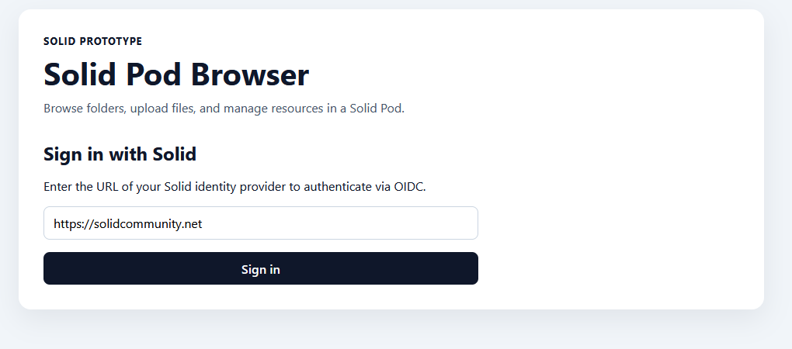
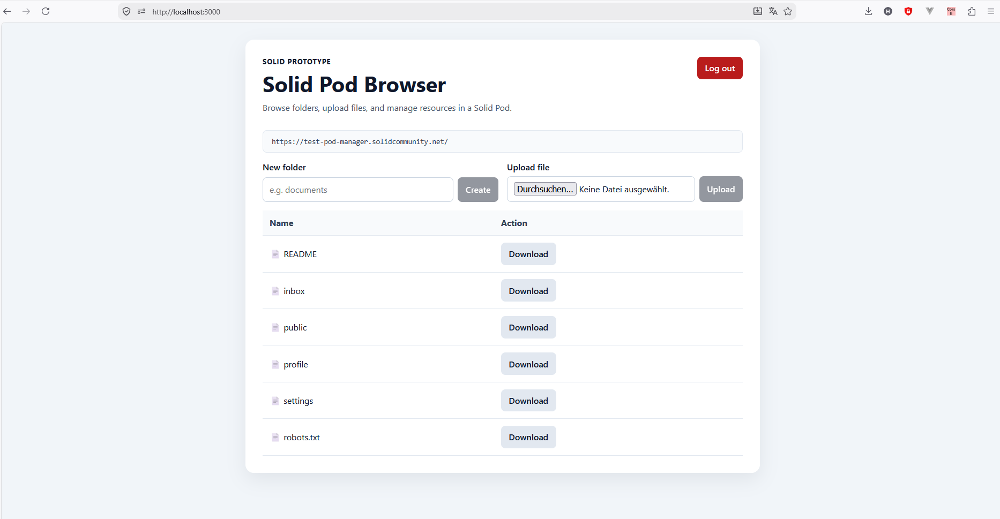

# Solid Pod Browser

A standalone React prototype for browsing and managing resources in a [Solid](https://solidproject.org/) Pod.

The project was created as a focused browser component before integration into a larger application. It demonstrates authentication with a Solid identity provider and common file-management operations against a user's Pod.

## Application Preview

### Solid Authentication

Users can sign in through a compatible Solid identity provider using OIDC authentication.



### Pod File Browser

After authentication, users can browse their Pod, navigate between folders, create new folders, upload files and download resources.



## Features

- Sign in with a Solid identity provider using OIDC
- Discover the authenticated user's Pod storage
- Browse folders and resources
- Navigate through nested containers
- Create folders
- Upload files
- Download files using the authenticated Solid session
- Responsive, lightweight web interface

## Tech Stack

- React
- JavaScript
- Inrupt Solid Client
- Inrupt Solid authentication and React UI libraries
- CSS
- Create React App

## Run Locally

### Prerequisites

- Node.js and npm
- A Solid identity and Pod from a compatible provider

### Installation

Install the project dependencies:

```bash
npm install
```

Start the development server:

```bash
npm start
```

The application starts at:

```text
http://localhost:3000
```

## Project Structure

```text
solid-pod-file-manager/
├── public/
├── src/
│   ├── components/
│   │   ├── FileActions.js       Folder creation controls
│   │   ├── FileTable.js         Resource list and file/folder actions
│   │   ├── FileUploader.js      File selection and upload controls
│   │   └── FolderNavigator.js   Current Pod path and back navigation
│   ├── services/
│   │   └── solidPodService.js   Solid data-access and file-management operations
│   ├── App.js                   Application state, authentication and orchestration
│   ├── App.css                  Component styling
│   ├── index.js                 React entry point and Solid SessionProvider
│   └── index.css                Global styles
├── log-in.png
├── pod-browser.png
├── README.md
└── package.json
```

The UI is split into focused React components, while Solid-specific data access is isolated in a service module. `App.js` coordinates authentication, navigation state and user actions instead of containing the complete interface implementation.

## Security Note

The application does not store user credentials. Authentication is handled through the Solid OIDC flow and the authenticated session provided by the Inrupt libraries.

